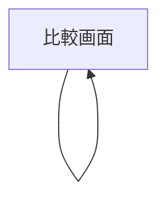

# UI

## 画面一覧

| 画面 | パス | 説明 |
|------|------|------|
| 比較画面 | `/` | ファイル指定フォーム + 差分表示を1画面に集約 |

## 画面遷移図



単一画面構成のため遷移なし。

## 画面機能仕様

### 比較画面

**ヘッダー**
- アプリ名 `GitHub Diff`
- PAT 設定ボタン（トークン入力モーダル / クリア）
  - 入力フォーム内に説明文を表示：「Classic PAT（スコープ: `repo`）を使用してください。プライベートリポジトリへのアクセスに必要です。パブリックリポジトリのみの場合は不要です。」
  - GitHub の PAT 発行ページへのリンクを表示

**ファイル指定エリア（左右2列）**

各列に以下の入力欄：
- Owner / Repository（プレースホルダー: `owner/repository または GitHub URL`）
  - GitHub のファイル URL（`https://github.com/{owner}/{repo}/blob/{ref}/{path}`）を貼り付けると全フィールドを自動補完（`#L10` などのハッシュフラグメントや `?plain=1` などのクエリは自動で除去）
  - フォーカスアウト時にブランチ・タグ一覧を取得し、Ref フィールドの補完候補（datalist）として表示
- Ref（ブランチ / タグ / コミット SHA）
  - フォーカスアウト時にファイルツリーを取得し、File Path フィールドの補完候補（datalist）として表示
- File Path

**比較ボタン**
- 左右すべてのフィールド（owner / repo / ref / path）が入力済みの場合のみ有効化。取得中も無効化。

**表示モード切替トグル**
- `Split`（サイドバイサイド）/ `Unified` の2択
- 差分が表示されている場合のみ有効

**差分表示エリア**
- `DiffViewer` コンポーネントで差分を表示
- 追加行: 緑、削除行: 赤、変更行: 黄

---

## 各画面の表示状態

| 状態 | 表示 |
|------|------|
| Loading | ボタンが "取得中..." に変化、無効化 |
| Empty | フォームのみ表示、差分エリアは非表示 |
| 初期ロード（URL パラメータ有） | マウント時に自動でファイル取得を開始し、完了後に差分を表示 |
| Error (404) | Left / Right に対応した列に "リポジトリまたはファイルが見つかりません" を個別表示 |
| Error (401/403) | Left / Right に対応した列に "プライベートリポジトリには PAT が必要です" を個別表示 |
| Error (Rate Limit) | Left / Right に対応した列に "API レート制限に達しました。PAT を入力するか、しばらく待ってください" を個別表示 |
| Success | 差分表示 |

## レイアウト構成

```
┌─────────────────────────────────┐
│ Header（タイトル + PAT設定）      │
├────────────────┬────────────────┤
│ 左ファイル指定  │ 右ファイル指定  │
├────────────────┴────────────────┤
│ [比較する]  [Split | Unified]    │
├─────────────────────────────────┤
│ 差分表示エリア                   │
└─────────────────────────────────┘
```

## コンポーネント一覧

| コンポーネント | 役割 |
|--------------|------|
| `FileSelector` | owner/repo/ref/path の入力フォーム（左右共通） |
| `DiffViewer` | 差分表示（モード切替対応） |
| `TokenSettings` | PAT 入力・保存・クリア UI |

## UI 規約

- スタイリング: Tailwind CSS のみ使用
- フォントサイズ: diff 表示は `text-sm`、等幅フォント
- カラー: Tailwind のデフォルトカラーパレットを使用（緑: `green-100/700`、赤: `red-100/700`）
