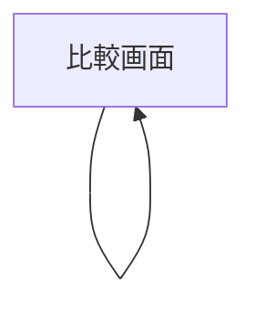

# UI

## 画面一覧

| 画面 | パス | 説明 |
|------|------|------|
| 比較画面 | `/` | ファイル指定フォーム + 差分表示を 1 画面に集約 |

## 画面遷移図



単一画面構成のため遷移なし。

## 画面機能仕様

### 比較画面

**ヘッダー**
- ダークヘッダーにアプリ名 `Diff Viewer` と GitHub アイコンを表示
- 「設定」ボタン: クリックで設定モーダルを開く
- 設定モーダル仕様:
  - タイトル: "設定"
  - "GitHub Token" セクション（白カード）内に入力欄・「検証」・「削除」ボタンを横並びで配置
  - トークン入力欄（既存トークンがある場合はマスク表示で初期値として入力、placeholder: `ghp_xxxxxxxxxxxx`）
  - 「検証」ボタン: トークンを `GET /user` で検証し、成功時に自動保存。入力欄が空の場合・検証中は無効化
  - 「削除」ボタン: トークン設定済みの場合のみ表示。クリックでトークン削除 + モーダルを閉じる。検証中は無効化
  - 検証成功時: "✓ @ユーザー名 として認証済み"（緑）を表示
  - 検証失敗時: "✗ エラーメッセージ"（赤）を表示
  - 使用する PAT は Classic PAT（スコープ: `repo`）。説明文・PAT 発行ページへのリンクを GitHub Token セクション内に表示
  - モーダルヘッダーに ✕ 閉じるボタン（`aria-label="設定を閉じる"`）を表示
  - トークン入力欄で Enter キーで検証、Escape キーでモーダルを閉じる
  - モーダルのオーバーレイ（背景暗転部分）クリックでモーダルを閉じる

**ファイル指定エリア（左右 2 列）**

左カードのヘッダーラベル: "比較元 (Left)"、右カードのヘッダーラベル: "比較先 (Right)"

各列に以下の入力欄：
- Owner / Repository（プレースホルダー: `owner/repository または GitHub URL`）
  - GitHub のファイル URL（`/blob/`・`/blame/`・`/raw/` 形式）を貼り付けると全フィールドを自動補完（`#L10` などのハッシュフラグメントや `?plain=1` などのクエリは自動で除去）
  - ref に `/` を含むブランチ名は貼り付け時に API でブランチ一覧を取得し正しく解決する
  - フォーカスアウト時にブランチ・タグ一覧を取得し、Ref フィールドの補完候補（datalist）として表示（URL 貼り付け時に既取得済みの場合は再取得しない）
- Ref（ブランチ / タグ / コミット）
  - フォーカスアウト時にファイルツリーを取得し、File Path フィールドの補完候補（datalist）として表示
- File Path

**Action Bar**
- 差分表示中は左側に緑ドット + "差分を表示中 — ファイル名" を表示（左右で異なる場合は `左のファイル名 / 右のファイル名` 形式）
- 差分未表示時は左側エリアは空
- 右側に表示モード切替トグルと比較ボタンを配置

**表示モード切替トグル**
- `Split`（サイドバイサイド）/ `Unified` の 2 択
- 差分が表示されている場合のみ有効

**比較ボタン**
- 左右すべてのフィールド（owner / repo / ref / path）が入力済みの場合のみ有効化。取得中も無効化
- ラベル: 通常 "比較する"、取得中 "取得中..."

**差分表示エリア**
- ファイル名ヘッダーバーを表示
- 追加行: 緑、削除行: 赤、変更行: 黄

---

## 各画面の表示状態

| 状態 | 表示 |
|------|------|
| Loading | ボタンが "取得中..." に変化、無効化 |
| Empty | フォームのみ表示、差分エリアは非表示 |
| 初期ロード（URL パラメータ有） | マウント時に自動でファイル取得を開始し、完了後に差分を表示 |
| Error (404) | Left / Right に対応した列に "リポジトリまたはファイルが見つかりません" を個別表示 |
| Error (401/403) | Left / Right に対応した列に "プライベートリポジトリには PAT が必要です" を個別表示 |
| Error (Rate Limit) | Left / Right に対応した列に "API レート制限に達しました。PAT を入力するか、しばらく待ってください" を個別表示 |
| Success | 差分表示 |

## レイアウト構成

```
┌─────────────────────────────────────────┐
│ Header（GitHub アイコン + Diff Viewer    │
│          + [設定] ボタン）               │
├──────────────┬───┬──────────────────────┤
│ 左ファイル指定 │ → │ 右ファイル指定        │
├──────────────┴───┴──────────────────────┤
│ ● ファイル名  [Split | Unified] [比較する] │
├─────────────────────────────────────────┤
│ ファイル名ヘッダー                        │
│ 差分表示エリア                            │
└─────────────────────────────────────────┘
```

## UI 規約

- スタイリング: Tailwind CSS のみ使用（任意値記法 `bg-[#0969da]` など）。具体的なクラスはコードを正とする
- フォントサイズ: diff 表示は `text-sm`、ファイル名は `font-mono text-xs`
- カラー: GitHub 風カラーを使用
  - ヘッダー背景: `#24292f`
  - ページ背景: `#f6f8fa`
  - ボーダー: `#d0d7de`
  - プライマリ（ボタン等）: `#0969da`
  - 成功（認証済み等）: `#1a7f37`
  - エラー: `#cf222e`
  - テキスト（主）: `#1f2328`、（補助）: `#636c76`
  - FileSelector L バッジ背景: `#0550ae`
  - FileSelector R バッジ背景: `#1a7f37`
